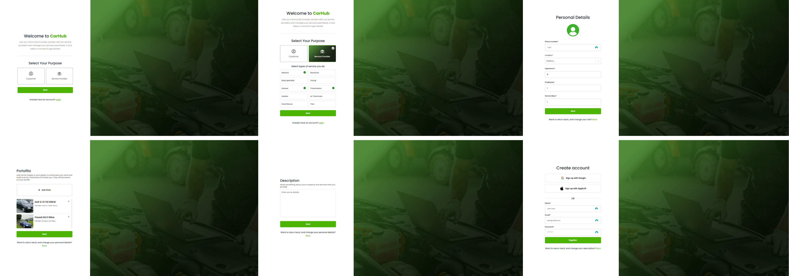
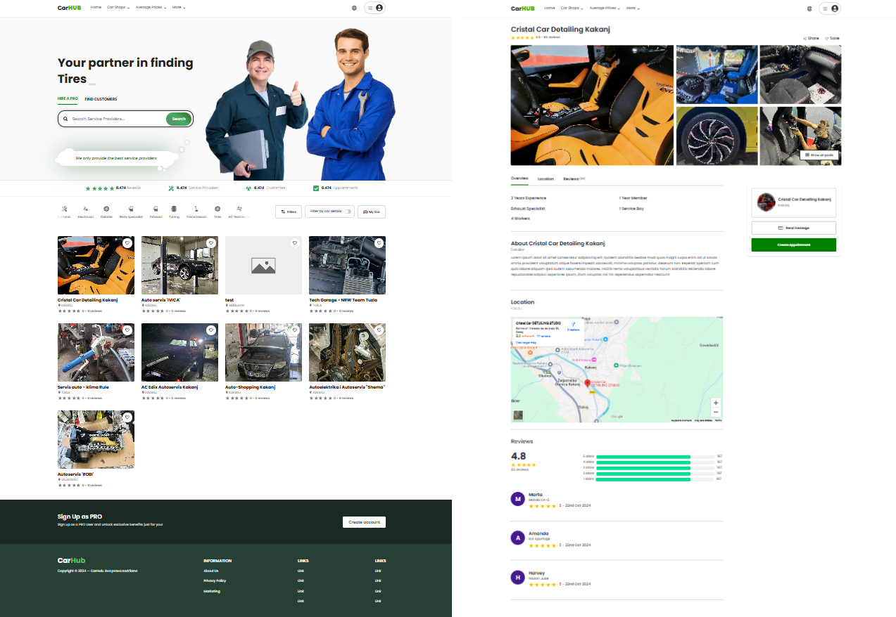

# CarHub

Welcome to the CarHub repository! This guide will help you get started with setting up the project and running it on your local machine.

## Getting Started

### Prerequisites

Make sure you have **Git**, **Node.js**, and **npm** installed on your system.

1. **Clone the repository**:

   ```bash
   https://github.com/aditokmoo/auto-industry-web-app.git

2. **Navigate to the project folder**:
   
   ```bash
   cd repo-name

3. **Navigate to the client folder and install the dependencies**:

   ```bash
   cd client
   npm install

4. **Do the same for the backend folder**:

   ```bash
   cd backend
   npm install

5. **Running the project**:
- Start the client:
   ```bash
   cd client
   npm run dev

- Start the backend:
   ```bash
   cd backend
   npm run dev

The client and backend should now be running locally.

# Note ( add .env into backend folder )
- .env file
   ```bash
   PORT=8000
   NODE_ENV=dev
   
   BACKEND_BASE_URL=http://127.0.0.1:8000
   FRONTEND_BASE_URL=http://localhost:5173
   
   MONGO_DB_URL=
   MONGO_DB_PASSWORD=
   
   EMAIL_SERVICE=
   EMAIL_HOST=
   EMAIL_PORT=
   EMAIL_USERNAME=
   EMAIL_PASSWORD=
   EMAIL_SENDER=
   EMAIL_SECURE=
   
   CLOUDINARY_CLOUD_NAME=
   CLOUDINARY_API_KEY=
   CLOUDINARY_API_SECRET=
   
   ACCESS_TOKEN=deadb0fe2cb150336e3cce1b7ff0ac17b1eed8941cb00ba756e47fb254036b7b76bd2bd00a59eb4b81b316a075ce1e6df7ce48dae8898e3c73d5862b8be42791
   REFRESH_TOKEN=fd998a8abf82184071985a2c880e835da896e8f936d875257519e505f5ba7b74e4c0c411354a6bb1b922fab8b9ddc4af9e4f8ea1c911df6d71e26349fe40befc

## Screenshots
Here are some images to showcase the project

1. Login


2. Register


3. Home and details page


note: project is in progress...

## Technologies Used

- **Frontend**: React, Typescript, Axios, React Form Hook, Tanstack React Query, SCSS
- **Backend**: Node.js, Express, MongoDB, Typescript, Cloudinary Socket.IO

